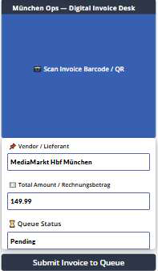
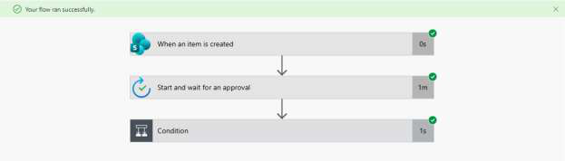
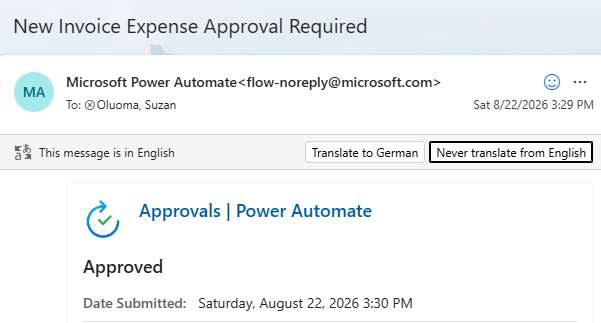
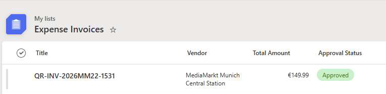

# Invoice Verification System

A low code expense approval app: employees submit invoices from a mobile app, the data lands in a validated database, and managers approve or reject straight from their email inbox. No chasing, no retyping, no lost paperwork.

## What it does

* Mobile submission, built as a Power Apps canvas app
* Validated data layer on Microsoft Lists, no premium licenses needed
* Automatic approval workflow in Power Automate
* Approvals handled from the email inbox with Adaptive Cards
* Complete audit trail that fits DSGVO and GoBD rules for invoice data in Germany

## How it works

1. The employee scans and submits an invoice in the mobile app
2. The app writes the record to Microsoft Lists; validation formulas reject bad entries
3. Power Automate triggers the moment the item is created and sends the manager an approval card
4. The manager approves or rejects from the email; the status updates by itself

## Result

The approval cycle dropped from about three days of chasing to under two hours, with no lost or duplicated invoices.

## Screenshots

## Demo video

A short walkthrough of the app is in this repo: [demo-video.mp4](demo-video.mp4)

## Stack

Power Apps (Canvas) | Power Automate | Microsoft Lists | Adaptive Cards

## Why this stack

Runs in any Microsoft 365 tenant without premium licenses, and managers never need a new login to approve: they just answer an email.

## What I want to add next

* OCR with AI Builder, so the app reads vendor, amount, and date straight from a photo of the invoice
* Approval levels based on the amount, and a loop that sends rejected invoices back to the submitter
* Teams notifications and a weekly summary report for the finance team

## How to build it yourself

1. Create a Microsoft Lists list with the fields: Vendor, Total Amount, Approval Status
2. Build a canvas app from the list in Power Apps
3. Create a Power Automate flow: when an item is created, start and wait for an approval, then update the status
4. Use Adaptive Cards in the approval step so the manager can answer from the inbox

## Flow export

The Power Automate flow export lives in `power-automate/` (see `power-automate/flow-export-howto.md`).

## Author

Suzan Olamide Oluoma | Munich, Germany | olamidesuzzy@gmail.com | linkedin.com/in/oluoma-suzan
